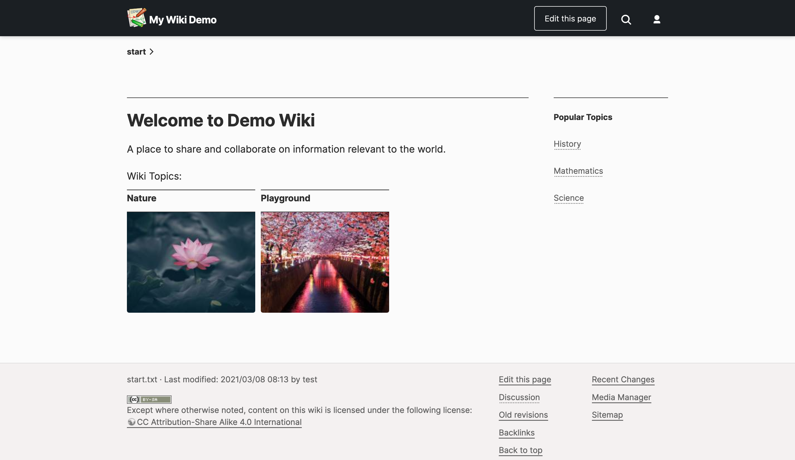

# typowiki
TypoWiki - Simple DokuWiki Theme

## Modular and structural

I have mixed feelings about doing a theme in the modernist vein. Nonetheless, the idea is to make a wiki as simple and easy-to-use as an evil corporate platform like Google Docs. It is designed to match the look and feel people are familiar with and be comfy to read on a desktop or phone.



## Installation

Move the "typowiki" folder to `lib/tpl/` and activate it via the admin interface.

## Suggested DokuWiki customizations

### Localization

Notice the "Edit" button in the top right corner of a page. This is a contextual button unique to this theme. To make it as straightforward as possible, I had to use custom localizations in DokuWiki.


For english, I suggest adding the following in your `conf/lang/en/lang.php` file. ([See the DokuWiki documentation for details.](https://www.dokuwiki.org/localization#changing_some_localized_texts_and_strings_in_your_installation))

```
$lang['btn_edit']        = 'Edit';
$lang['btn_show']        = 'Cancel';
$lang['btn_create']      = 'Create';
$lang['loggedinas']      = '';
$lang['lastmod']         = 'Last edit was';
```

Para español (`conf/lang/es/lang.php`):

```
$lang['btn_edit']        = 'Editar';
$lang['btn_show']        = 'Cancelar';
$lang['btn_create']      = 'Crear';
$lang['loggedinas']      = '';
```

### Custom Editor Icons

I made some custom retina icons for the edit bar. They're not the greatest, but they are a bit more tasteful to our 2020 sensibilities than the default ones. You can find them in the "extras" folder. To use, just move the png files to `lib/images/toolbar/`. Keep a backup of the standard ones to be safe.


## That's it...

Do something cool, take back control of information from the corporate overlords. Center BIPOC women in your wiki project. PRs welcome.
