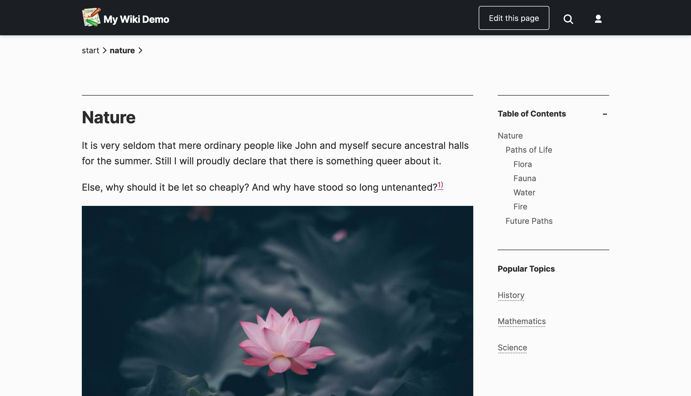

# typowiki
Simple, responsive DokuWiki Template

All documentation at DokuWiki template page: https://www.dokuwiki.org/template:typowiki

## Screenshots

I have mixed feelings about doing a theme in the modernist vein. Nonetheless, the idea is to make a wiki as simple and easy-to-use as an evil corporate platform like Google Docs. It is designed to match the look and feel people are familiar with and be comfy to read on a desktop or phone.

(Pictured with the [NSPages](https://www.dokuwiki.org/plugin:nspages) plugin.)

